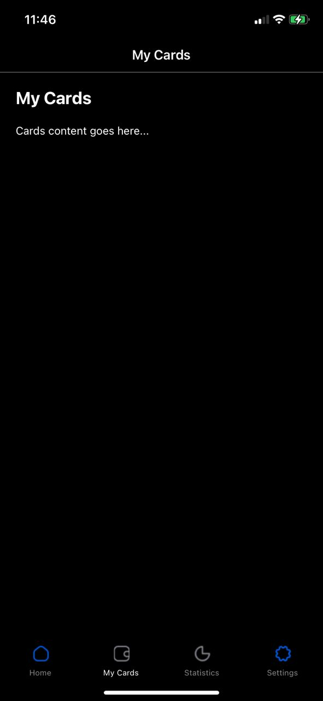

# rn-assignment5-11279787
## Overview
This repository contains the frontend source code for our native banking application designed for iOS and Android platforms. The app provides users with a streamlined interface to access essential banking functionalities.

## Pages Included
#### Home Page:
 Displays an overview of account balances and recent transactions.
#### My Cards Page:
 Shows a list of user cards with options for managing them.

#### Statistics Page:
 Presents visual insights into spending habits and financial summaries.

#### Settings Page: 
Allows users to customize app preferences and manage security settings.

# SCREENSHOT OF APP
### Home Screen
 

### Settings Screen
 

#### Other pages
  

##
 
